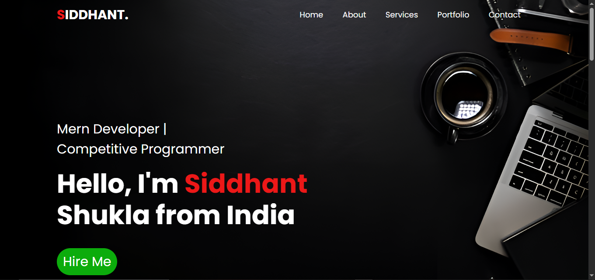
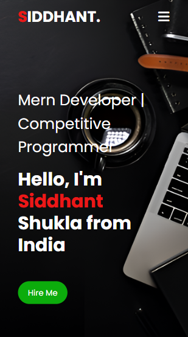

<div align="center">

# 🚀 Siddhant Shukla — Personal Portfolio

[](https://developer.mozilla.org/en-US/docs/Web/HTML)
[](https://developer.mozilla.org/en-US/docs/Web/CSS)
[](https://developer.mozilla.org/en-US/docs/Web/JavaScript)
[](https://fontawesome.com/)

> *"Building dreams in code, one bug at a time."*

A sleek, fully responsive personal portfolio website built with vanilla **HTML**, **CSS**, and **JavaScript** — featuring a dark-themed UI, smooth animations, and a working contact form.

[**View Live Demo »**](https://siddhantshukla108.github.io/My-Portfolio) · [**Report Bug »**](../../issues) · [**Request Feature »**](../../issues)

</div>

---

## ✨ Features

| Feature | Description |
|---|---|
| 🎨 **Dark Theme UI** | Premium dark aesthetic with vibrant red (`#ff004f`) accent color scheme |
| 📱 **Fully Responsive** | Adapts seamlessly from desktop to mobile with a slide-in hamburger menu |
| 🧭 **Smooth Navigation** | Single-page layout with smooth scroll navigation between sections |
| 🧑‍💻 **Interactive Tabs** | Skills, Experience & Education tabs with dynamic content switching |
| 🖼️ **Project Showcase** | Hover-to-reveal overlay cards displaying project details |
| 📨 **Contact Form** | Functional form with Google Sheets integration for message collection |
| ⚡ **Micro-Animations** | Hover effects, underline transitions, card lifts & image zoom on interaction |

---

## 📸 Preview

<div align="center">

| Desktop | Mobile |
|---|---|
|  |  |

</div>

---

## 🏗️ Project Structure

```
My-Portfolio/
│
├── index.html          # Main HTML — all sections (Home, About, Services, Portfolio, Contact)
├── style.css           # Complete styling — dark theme, responsive breakpoints, animations
├── script.js           # Tab switching logic (Skills / Experience / Education)
├── mobile.js           # Mobile hamburger menu open/close handlers
├── 4.jpg               # Favicon
│
└── images/
    ├── bg1_enhanced_enhanced.png   # Desktop hero background
    ├── new.png                     # Mobile hero background
    ├── two.png                     # About section profile image
    ├── bookStore.avif              # Project thumbnail — Online Book Store
    ├── foodStore.png               # Project thumbnail — Food Store
    ├── Travel.png                  # Project thumbnail — Travelling Website
    └── ...                         # Other assets
```

---

## 🛠️ Tech Stack

- **Structure** — HTML5 with semantic markup
- **Styling** — Vanilla CSS3 (Flexbox, CSS Grid, Media Queries, Transitions)
- **Typography** — [Google Fonts — Poppins](https://fonts.google.com/specimen/Poppins)
- **Icons** — [Font Awesome 6](https://fontawesome.com/)
- **Form Backend** — Google Apps Script (Google Sheets integration)

---

## 🚀 Getting Started

### Prerequisites

No build tools, package managers, or frameworks needed — just a browser!

### Run Locally

1. **Clone the repository**

   ```bash
   git clone https://github.com/siddhantshukla108/My-Portfolio.git
   ```

2. **Navigate to the project**

   ```bash
   cd My-Portfolio
   ```

3. **Open in browser**

   Simply open `index.html` in your browser, or use a live server:

   ```bash
   # Using VS Code Live Server extension, or:
   npx serve .
   ```

### Set Up Contact Form (Optional)

The contact form submits messages to a Google Sheet via Apps Script.

1. Create a Google Sheet and open **Extensions → Apps Script**.
2. Deploy a web app that accepts `POST` requests and writes form data to the sheet.
3. Copy the deployment URL and replace the placeholder in `index.html`:

   ```js
   const scriptURL = 'YOUR_GOOGLE_SHEETS_SCRIPT_URL_HERE'
   ```

---

## 📄 Sections

| # | Section | Description |
|---|---|---|
| 1 | **Home** | Hero banner with name, title, and CTA button |
| 2 | **About** | Bio, profile image, and tabbed Skills/Experience/Education |
| 3 | **Services** | Service cards for Web Design, Competitive Programming & UI Design |
| 4 | **Portfolio** | Project showcase with hover-reveal overlays |
| 5 | **Contact** | Contact info, social links, CV download, and a message form |

---

## 🤝 Contributing

Contributions, issues, and feature requests are welcome!

1. Fork the project
2. Create your feature branch — `git checkout -b feature/amazing-feature`
3. Commit your changes — `git commit -m "Add amazing feature"`
4. Push to the branch — `git push origin feature/amazing-feature`
5. Open a Pull Request

---

## 📜 License

This project is open source and available under the [MIT License](LICENSE).

---

## 📬 Connect

[](https://www.linkedin.com/in/siddhant-shukla-182420298/)
[](https://github.com/siddhantshukla108)

---

<div align="center">

**⭐ If you found this project helpful, please give it a star!**

Made with ❤️ by **Siddhant Shukla**

</div>
